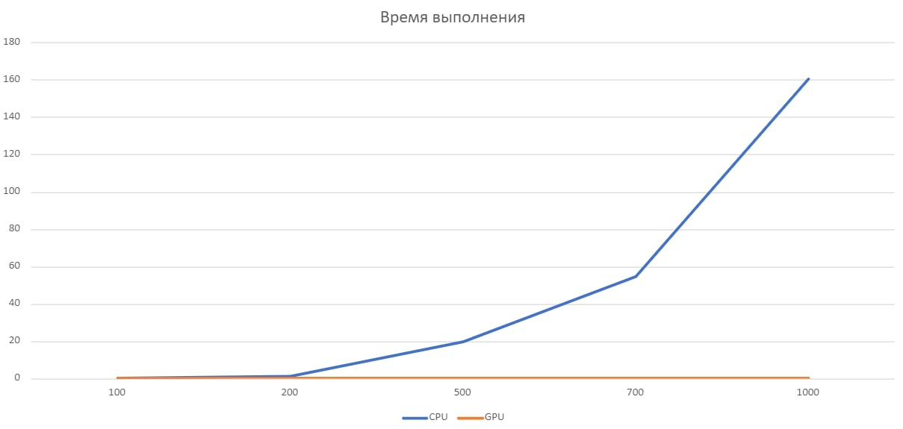
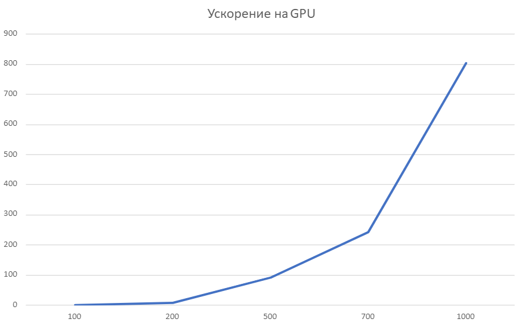

#L0 MatMul
В данной лабораторной работе выполнена реализация алгоритма подсчета произведения матриц на **CPU** и **GPU** размерностями от 100х100 до 2000х2000.

Реализация выполнена на языке **Python**.
Реализация алгоритма на GPU написана с использованием CUDA с помощью библиотеки numba.
Использовался **@cuda.jit** - декоратор для ускорения.

В данной работе распараллелено вычисление элементов результирующей матрицы для получения ускорения.

Ниже представлены графики **зависимости времени выполнения программы от размеров входных матриц**.

 

Также представлены графики **ускорения вычислений на GPU в зависимости от размеров матриц**.

